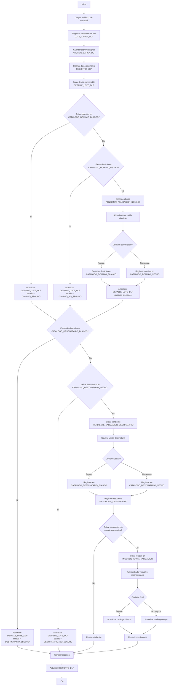

## Proyecto DLP - Validación de Dominios y Destinatarios

## 1. Objetivo

Implementar una aplicación que permita cargar mensualmente registros DLP, procesar dominios y destinatarios externos, identificar elementos seguros/no seguros, gestionar validaciones por administrador y usuarios, resolver inconsistencias y generar reportes de seguimiento.

---

## 2. Alcance General

La solución permitirá:

* Cargar archivos DLP mensuales de aproximadamente **180,000 registros**.
* Registrar una cabecera de lote por cada carga.
* Guardar el archivo original como evidencia.
* Almacenar los registros originales sin alterar.
* Procesar el lote en una tabla de detalle procesado.
* Validar dominios contra listas blancas y negras.
* Validar destinatarios contra listas blancas y negras.
* Generar pendientes de validación de dominios para el administrador.
* Generar pendientes de validación de destinatarios para los usuarios.
* Detectar inconsistencias cuando un mismo destinatario tenga decisiones contradictorias.
* Permitir que el administrador resuelva inconsistencias.
* Generar reportes operativos y ejecutivos.

---

## 3. Archivo de Entrada Mensual

El archivo mensual tendrá la siguiente estructura:

| Campo                          | Descripción                                |
| ------------------------------ | ------------------------------------------ |
| Nombre Politica                | Política DLP que generó el incidente       |
| User Group                     | Grupo o unidad asociada al usuario         |
| From_user                      | Usuario remitente original                 |
| #Groups_source                 | Grupo origen                               |
| #Time hora Estándar De Perú    | Fecha y hora del evento                    |
| #Dlp_incident_id               | Identificador del incidente DLP            |
| Fecha                          | Fecha del incidente                        |
| Usuario Ext                    | Usuario externo detectado                  |
| Dominio Ext                    | Dominio externo                            |
| DestinatarioExt                | Correo externo completo                    |
| Correo Usuario Alicorp         | Correo corporativo del usuario responsable |
| Vicepresidencia - Usuario      | Vicepresidencia del usuario                |
| Dirección y Gerencia - Usuario | Dirección o gerencia                       |
| Unidad Organizativa - Usuario  | Unidad organizativa                        |
| Nombre de Posición             | Cargo del usuario                          |

---

## 4. Tablas Funcionales Principales

| Tabla                               | Propósito                                   |
| ----------------------------------- | ------------------------------------------- |
| `LOTE_CARGA_DLP`                    | Cabecera del lote mensual                   |
| `ARCHIVO_CARGA_DLP`                 | Evidencia del archivo cargado               |
| `REGISTRO_DLP`                      | Registros originales importados del archivo |
| `DETALLE_LOTE_DLP`                  | Resultado procesado por registro            |
| `CATALOGO_DOMINIO_BLANCO`           | Lista blanca de dominios                    |
| `CATALOGO_DOMINIO_NEGRO`            | Lista negra de dominios                     |
| `CATALOGO_DESTINATARIO_BLANCO`      | Lista blanca de destinatarios               |
| `CATALOGO_DESTINATARIO_NEGRO`       | Lista negra de destinatarios                |
| `PENDIENTE_VALIDACION_DOMINIO`      | Dominios pendientes para el administrador   |
| `PENDIENTE_VALIDACION_DESTINATARIO` | Destinatarios pendientes para usuarios      |
| `VALIDACION_DESTINATARIO`           | Respuestas de los usuarios                  |
| `INCONSISTENCIA_VALIDACION`         | Conflictos detectados                       |
| `AUDITORIA_DLP`                     | Trazabilidad de acciones                    |
| `REPORTE_DLP`                       | Datos consolidados para reportes            |

---

## 5. Actores

| Actor                       | Responsabilidad                                           |
| --------------------------- | --------------------------------------------------------- |
| Administrador DLP           | Carga archivos, valida dominios, resuelve inconsistencias |
| Usuario Alicorp             | Valida destinatarios externos asignados                   |
| Seguridad de la Información | Supervisa resultados, reportes y decisiones               |
| Auditor / Consulta          | Revisa trazabilidad y evidencias                          |

---

## 6. Funcionalidades

## 6.1 Carga Mensual del Archivo

El administrador podrá cargar el archivo mensual DLP.

El sistema deberá:

* Validar estructura del archivo.
* Validar columnas obligatorias.
* Registrar cabecera en `LOTE_CARGA_DLP`.
* Guardar evidencia en `ARCHIVO_CARGA_DLP`.
* Insertar datos originales en `REGISTRO_DLP`.
* Generar registros procesables en `DETALLE_LOTE_DLP`.

`REGISTRO_DLP` no deberá modificarse después de la carga, salvo correcciones controladas y auditadas.

---

## 6.2 Procesamiento del Lote

El sistema procesará los registros desde `DETALLE_LOTE_DLP`.

Por cada registro:

1. Validará si el dominio externo está en lista blanca.
2. Validará si el dominio externo está en lista negra.
3. Si el dominio no existe en ninguna lista, generará pendiente de validación de dominio.
4. Validará si el destinatario está en lista blanca.
5. Validará si el destinatario está en lista negra.
6. Si el destinatario no existe en ninguna lista, generará pendiente para el usuario.

---

## 6.3 Validación de Dominios

Los dominios pendientes serán revisados por el administrador.

El administrador podrá marcar un dominio como:

* Seguro.
* No seguro.

Si lo marca como seguro:

* Se inserta en `CATALOGO_DOMINIO_BLANCO`.
* Se actualizan los registros afectados en `DETALLE_LOTE_DLP`.

Si lo marca como no seguro:

* Se inserta en `CATALOGO_DOMINIO_NEGRO`.
* Se actualizan los registros afectados en `DETALLE_LOTE_DLP`.

---

## 6.4 Validación de Destinatarios

Los destinatarios pendientes serán mostrados al usuario Alicorp responsable.

El usuario podrá marcar un destinatario como:

* Seguro.
* No seguro.

Debe registrar una justificación obligatoria.

Si lo marca como seguro:

* Se registra en `CATALOGO_DESTINATARIO_BLANCO`.
* Se registra la validación en `VALIDACION_DESTINATARIO`.

Si lo marca como no seguro:

* Se registra en `CATALOGO_DESTINATARIO_NEGRO`.
* Se registra la validación en `VALIDACION_DESTINATARIO`.

---

## 6.5 Validación por Más de un Usuario

Un mismo destinatario externo puede estar asociado a más de un usuario Alicorp.

Ejemplo:

```text
usuario1@alicorp.com.pe → proveedor@gmail.com → seguro
usuario2@alicorp.com.pe → proveedor@gmail.com → no seguro
```

El sistema deberá permitir decisiones distintas por usuario.

Cuando existan decisiones contradictorias sobre el mismo destinatario, el sistema deberá crear una inconsistencia en:

```text
INCONSISTENCIA_VALIDACION
```

---

## 6.6 Resolución de Inconsistencias

El administrador podrá revisar inconsistencias.

Podrá decidir:

* Mantener el destinatario como seguro para ciertos usuarios.
* Mantener el destinatario como no seguro para ciertos usuarios.
* Elevar el dominio o destinatario a lista negra global.
* Elevar el dominio o destinatario a lista blanca global.
* Solicitar mayor sustento.

Toda decisión deberá quedar auditada.

---

## 7. Reglas de Negocio

## 7.1 Prioridad de Validación

La prioridad será:

```text
1. Dominio en lista blanca
2. Dominio en lista negra
3. Destinatario en lista blanca
4. Destinatario en lista negra
5. Pendiente de validación
```

---

## 7.2 Dominio en Lista Blanca

Si el dominio externo está en `CATALOGO_DOMINIO_BLANCO`:

```text
DETALLE_LOTE_DLP.estado = DOMINIO_SEGURO
```

El destinatario se considera seguro para ese lote.

---

## 7.3 Dominio en Lista Negra

Si el dominio externo está en `CATALOGO_DOMINIO_NEGRO`:

```text
DETALLE_LOTE_DLP.estado = DOMINIO_NO_SEGURO
```

El registro queda observado o escalado.

---

## 7.4 Dominio No Clasificado

Si el dominio no está en lista blanca ni negra:

```text
Se crea registro en PENDIENTE_VALIDACION_DOMINIO
```

El administrador deberá validarlo.

---

## 7.5 Destinatario en Lista Blanca

Si el destinatario está en `CATALOGO_DESTINATARIO_BLANCO` para ese usuario:

```text
DETALLE_LOTE_DLP.estado = DESTINATARIO_SEGURO
```

---

## 7.6 Destinatario en Lista Negra

Si el destinatario está en `CATALOGO_DESTINATARIO_NEGRO` para ese usuario:

```text
DETALLE_LOTE_DLP.estado = DESTINATARIO_NO_SEGURO
```

---

## 7.7 Destinatario No Clasificado

Si el destinatario no está en lista blanca ni negra:

```text
Se crea registro en PENDIENTE_VALIDACION_DESTINATARIO
```

El usuario deberá validarlo.

---

## 8. Estados del Lote

| Estado            | Descripción                          |
| ----------------- | ------------------------------------ |
| CARGADO           | Archivo cargado                      |
| VALIDADO          | Estructura validada                  |
| PROCESANDO        | Procesamiento en ejecución           |
| PROCESADO         | Procesamiento finalizado             |
| CON_OBSERVACIONES | Existen pendientes o inconsistencias |
| CERRADO           | Lote cerrado                         |
| ERROR             | Error en carga o procesamiento       |

---

## 9. Estados del Detalle del Lote

| Estado                 | Descripción                             |
| ---------------------- | --------------------------------------- |
| PENDIENTE_PROCESO      | Registro pendiente de evaluación        |
| DOMINIO_SEGURO         | Dominio encontrado en lista blanca      |
| DOMINIO_NO_SEGURO      | Dominio encontrado en lista negra       |
| DOMINIO_PENDIENTE      | Dominio pendiente de validación         |
| DESTINATARIO_SEGURO    | Destinatario encontrado en lista blanca |
| DESTINATARIO_NO_SEGURO | Destinatario encontrado en lista negra  |
| DESTINATARIO_PENDIENTE | Destinatario pendiente de validación    |
| INCONSISTENTE          | Existe conflicto de validaciones        |
| CERRADO                | Registro cerrado                        |

---

## 10. Pantallas Requeridas

## 10.1 Carga de Lote

* Cargar archivo.
* Seleccionar periodo.
* Validar estructura.
* Ver resumen de carga.
* Ejecutar procesamiento.
* Ver errores de carga.

---

## 10.2 Bandeja de Dominios Pendientes

Para administrador.

* Ver dominios no clasificados.
* Ver cantidad de registros asociados.
* Ver cantidad de usuarios afectados.
* Marcar como dominio seguro.
* Marcar como dominio no seguro.
* Registrar justificación.

---

## 10.3 Bandeja de Destinatarios Pendientes

Para usuario Alicorp.

* Ver destinatarios pendientes.
* Ver dominio externo.
* Ver incidente DLP.
* Ver política DLP.
* Ver fecha.
* Responder seguro / no seguro.
* Registrar justificación.

---

## 10.4 Listas Blancas y Negras

Para administrador.

* Ver dominios seguros.
* Ver dominios no seguros.
* Ver destinatarios seguros.
* Ver destinatarios no seguros.
* Buscar por dominio, destinatario, usuario o periodo.
* Activar / desactivar registros.
* Ver historial.

---

## 10.5 Inconsistencias

Para administrador.

* Ver destinatarios con decisiones contradictorias.
* Ver usuarios que marcaron seguro.
* Ver usuarios que marcaron no seguro.
* Ver justificaciones.
* Resolver inconsistencia.
* Registrar decisión final.

---

## 10.6 Reportes

* Resumen mensual del lote.
* Total de registros cargados.
* Total de dominios seguros.
* Total de dominios no seguros.
* Total de dominios pendientes.
* Total de destinatarios seguros.
* Total de destinatarios no seguros.
* Total de destinatarios pendientes.
* Inconsistencias abiertas.
* Inconsistencias cerradas.
* Top dominios no seguros.
* Top destinatarios no seguros.
* Usuarios con más validaciones pendientes.
* Reporte por VP, gerencia y unidad organizativa.

---

## 11. Diagrama de Flujo Funcional



---

## 12. Resultado Esperado

Al finalizar, la organización contará con una plataforma que permite:

* Controlar registros DLP mensuales.
* Clasificar dominios como seguros o no seguros.
* Clasificar destinatarios como seguros o no seguros.
* Evitar validaciones repetitivas.
* Detectar contradicciones entre usuarios.
* Resolver inconsistencias desde un administrador.
* Mantener evidencia y trazabilidad.
* Generar reportes de cumplimiento y seguimiento.
