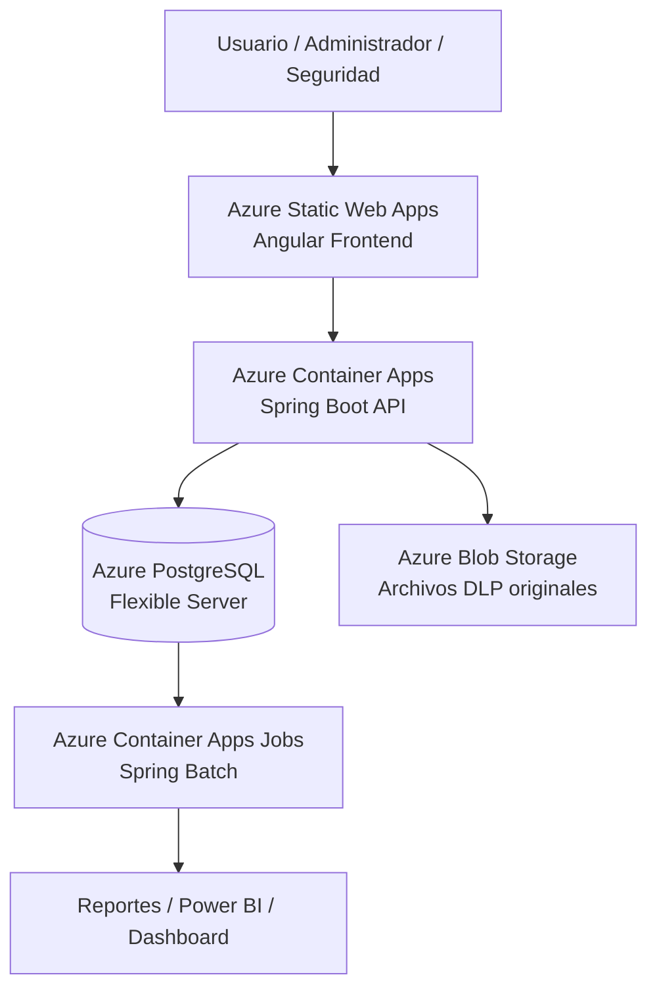
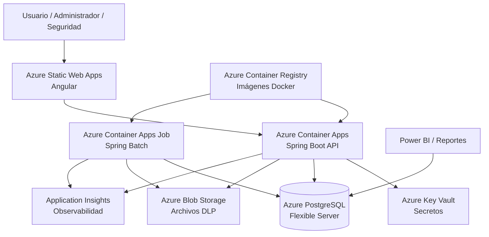
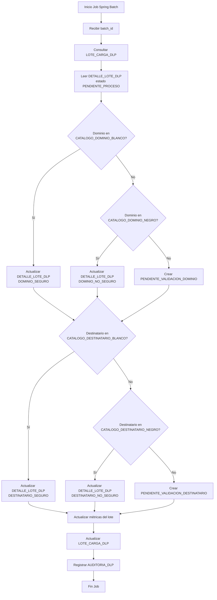

## Proyecto DLP - Validación de Dominios y Destinatarios

## 1. Objetivo Técnico

Implementar una plataforma web en Azure para cargar, procesar, validar y reportar registros DLP mensuales, utilizando una arquitectura cloud-native basada en contenedores Docker, PostgreSQL administrado, frontend Angular y backend Java con Spring Boot y Spring Batch.

La solución debe permitir:

- Carga mensual de archivos DLP.
- Procesamiento batch de aproximadamente 180,000 registros mensuales.
- Clasificación de dominios y destinatarios mediante listas blancas y negras.
- Validación de dominios por administrador.
- Validación de destinatarios por usuarios Alicorp.
- Resolución de inconsistencias por administrador.
- Trazabilidad, auditoría y reportes.
- Despliegue seguro y mantenible en Microsoft Azure.

---

## 2. Stack Tecnológico Recomendado

| Capa | Tecnología |
|---|---|
| Frontend | Angular 17+ |
| Backend API | Java 21 + Spring Boot 3 |
| Procesamiento Batch | Spring Batch |
| Base de datos | Azure Database for PostgreSQL Flexible Server |
| Contenedores | Docker |
| Ejecución Backend | Azure Container Apps |
| Ejecución Batch | Azure Container Apps Jobs |
| Registro de imágenes | Azure Container Registry |
| Archivos | Azure Blob Storage |
| Secretos | Azure Key Vault |
| Autenticación | Microsoft Entra ID |
| Reportes | Power BI / módulo web |
| Observabilidad | Application Insights + Log Analytics |
| CI/CD | Azure DevOps Pipelines o GitHub Actions |
| Migraciones BD | Flyway |
| Infraestructura como código | Terraform o Bicep |

---

## 3. Decisión Técnica: Spring Boot vs Quarkus

## 3.1 Recomendación

Se recomienda utilizar:

```text
Spring Boot 3 + Spring Batch
```

## 3.2 Justificación

Spring Boot es la opción recomendada para este proyecto debido a que:

- El sistema requiere procesamiento batch mensual.
- Spring Batch permite procesar grandes volúmenes por chunks.
- Permite manejar reintentos, errores, checkpoints y estados de ejecución.
- Tiene integración madura con PostgreSQL.
- Facilita la implementación de APIs REST, seguridad, auditoría y jobs.
- Tiene mayor disponibilidad de perfiles técnicos para mantenimiento.
- Es más adecuado para procesos transaccionales y trazables.

## 3.3 Uso de Quarkus

Quarkus podría evaluarse si:

- Se prioriza bajo consumo de memoria.
- Se requiere arranque extremadamente rápido.
- El equipo tiene experiencia consolidada en Quarkus.
- El sistema será orientado principalmente a microservicios livianos.

Para este proyecto, la prioridad es batch, trazabilidad, auditoría, seguridad corporativa y mantenibilidad, por lo que se define Spring Boot como tecnología backend principal.

---

## 4. Arquitectura Técnica General



---

## 5. Componentes de Azure

## 5.1 Azure Static Web Apps

Hospedará el frontend Angular.

Responsabilidades:

- Publicar la aplicación web.
- Servir la interfaz de usuario.
- Integrarse con el pipeline CI/CD.
- Consumir APIs del backend.
- Manejar rutas del frontend.
- Separar despliegues por ambiente.

---

## 5.2 Azure Container Apps

Hospedará el backend Spring Boot.

Responsabilidades:

- Exponer APIs REST.
- Gestionar autenticación y autorización.
- Procesar solicitudes de usuarios.
- Consultar y actualizar PostgreSQL.
- Integrarse con Blob Storage.
- Registrar auditoría.
- Consultar reportes operativos.
- Exponer health checks.

---

## 5.3 Azure Container Apps Jobs

Ejecutará los procesos batch.

Responsabilidades:

- Procesar lotes DLP.
- Validar dominios.
- Validar destinatarios.
- Crear pendientes de validación.
- Actualizar `DETALLE_LOTE_DLP`.
- Detectar inconsistencias.
- Actualizar estados del lote.
- Generar datos consolidados para reportes.

Tipos de ejecución:

```text
Manual     → ejecutado por el administrador desde la aplicación.
Programado → ejecución controlada por calendario.
Reproceso  → ejecución puntual de un lote específico.
```

---

## 5.4 Azure Database for PostgreSQL Flexible Server

Base de datos principal.

Responsabilidades:

- Persistir lotes.
- Persistir registros originales.
- Persistir detalle procesado.
- Mantener listas blancas y negras.
- Registrar validaciones.
- Registrar inconsistencias.
- Registrar auditoría.
- Servir datos para reportes.

Recomendaciones:

- Usar PostgreSQL 16 o superior.
- Activar backups automáticos.
- Configurar alta disponibilidad según criticidad.
- Usar índices sobre campos de búsqueda frecuentes.
- Evaluar particionamiento mensual.

---

## 5.5 Azure Blob Storage

Almacenará los archivos originales cargados.

Responsabilidades:

- Guardar CSV/XLSX mensual.
- Conservar evidencia de carga.
- Asociar archivo al lote.
- Permitir trazabilidad.
- Evitar almacenar archivos grandes directamente en la base de datos.

Contenedores sugeridos:

```text
dlp-input-files
dlp-processed-files
dlp-error-files
dlp-report-exports
```

---

## 5.6 Azure Container Registry

Almacenará las imágenes Docker.

Imágenes sugeridas:

```text
dlp-api
dlp-batch
```

Recomendación inicial:

```text
Usar una sola imagen backend y ejecutar distintos comandos según sea API o Job.
```

---

## 5.7 Azure Key Vault

Gestionará secretos y configuraciones sensibles.

Secretos sugeridos:

```text
POSTGRES_HOST
POSTGRES_DATABASE
POSTGRES_USER
POSTGRES_PASSWORD
STORAGE_ACCOUNT_NAME
STORAGE_CONNECTION_STRING
ENTRA_CLIENT_ID
ENTRA_CLIENT_SECRET
JWT_SECRET
APPLICATIONINSIGHTS_CONNECTION_STRING
```

---

## 5.8 Microsoft Entra ID

Usado para autenticación corporativa.

Roles funcionales sugeridos:

```text
DLP_ADMIN
DLP_SECURITY
DLP_USER
DLP_AUDITOR
```

Responsabilidades:

- Autenticación corporativa.
- Inicio de sesión SSO.
- Validación de identidad.
- Asignación de roles.
- Control de acceso por perfil.

---

## 5.9 Application Insights y Log Analytics

Responsabilidades:

- Registrar trazas.
- Monitorear errores.
- Registrar tiempos de respuesta.
- Monitorear jobs batch.
- Generar alertas por errores.
- Consultar logs técnicos.
- Correlacionar operaciones por `batch_id`.

---

## 6. Arquitectura de Aplicación

## 6.1 Frontend Angular

Módulos sugeridos:

```text
auth
dashboard
carga-lotes
dominios
destinatarios
validaciones
inconsistencias
reportes
auditoria
shared
core
```

Pantallas principales:

- Login corporativo.
- Dashboard DLP.
- Carga mensual.
- Bandeja de dominios pendientes.
- Bandeja de destinatarios pendientes.
- Listas blancas y negras.
- Inconsistencias.
- Reportes.
- Auditoría.
- Administración de usuarios y roles, si aplica.

---

## 6.2 Backend Spring Boot

Estructura lógica sugerida:

```text
dlp-api
├── auth
├── batch
├── carga
├── dominios
├── destinatarios
├── validaciones
├── inconsistencias
├── reportes
├── auditoria
├── storage
├── notification
└── shared
```

Capas técnicas:

```text
Controller
Service
Repository
Entity
DTO
Mapper
Exception Handler
Security
Audit
Configuration
```

---

## 6.3 Procesamiento Batch

Spring Batch debe procesar por chunks.

Flujo del job principal:

```text
1. Recibir batch_id.
2. Leer registros de DETALLE_LOTE_DLP en estado PENDIENTE_PROCESO.
3. Validar dominio contra CATALOGO_DOMINIO_BLANCO.
4. Validar dominio contra CATALOGO_DOMINIO_NEGRO.
5. Crear PENDIENTE_VALIDACION_DOMINIO si el dominio no está clasificado.
6. Validar destinatario contra CATALOGO_DESTINATARIO_BLANCO.
7. Validar destinatario contra CATALOGO_DESTINATARIO_NEGRO.
8. Crear PENDIENTE_VALIDACION_DESTINATARIO si el destinatario no está clasificado.
9. Detectar inconsistencias.
10. Actualizar estados en DETALLE_LOTE_DLP.
11. Actualizar estado en LOTE_CARGA_DLP.
12. Registrar auditoría y métricas.
```

Parámetros del job:

```text
batch_id
periodo
usuario_ejecucion
modo_ejecucion
```

Modos de ejecución:

```text
PROCESO_INICIAL
REPROCESO_DOMINIOS
REPROCESO_DESTINATARIOS
REPROCESO_INCONSISTENCIAS
```

---

## 7. Modelo de Base de Datos

## 7.1 Tablas Principales

```text
LOTE_CARGA_DLP
ARCHIVO_CARGA_DLP
REGISTRO_DLP
DETALLE_LOTE_DLP
CATALOGO_DOMINIO_BLANCO
CATALOGO_DOMINIO_NEGRO
CATALOGO_DESTINATARIO_BLANCO
CATALOGO_DESTINATARIO_NEGRO
PENDIENTE_VALIDACION_DOMINIO
PENDIENTE_VALIDACION_DESTINATARIO
VALIDACION_DESTINATARIO
INCONSISTENCIA_VALIDACION
AUDITORIA_DLP
REPORTE_DLP
```

---

## 7.2 Principios de Diseño de Datos

- `LOTE_CARGA_DLP` almacena la cabecera del lote.
- `ARCHIVO_CARGA_DLP` almacena metadatos del archivo original.
- `REGISTRO_DLP` almacena los datos crudos importados.
- `REGISTRO_DLP` no debe alterarse durante el procesamiento.
- `DETALLE_LOTE_DLP` almacena el resultado procesado por registro.
- Las listas blancas/negras se consultan para clasificación.
- Las validaciones de usuario se guardan de forma trazable.
- Las inconsistencias se resuelven por administrador.
- Toda acción sensible debe registrarse en `AUDITORIA_DLP`.

---

## 7.3 Tablas con Particionamiento Recomendado

Se recomienda particionar por periodo mensual:

```text
REGISTRO_DLP
DETALLE_LOTE_DLP
AUDITORIA_DLP
```

Campos sugeridos para particionamiento:

```text
periodo_anio
periodo_mes
fecha_evento
fecha_carga
```

---

## 7.4 Índices Recomendados

```sql
CREATE INDEX idx_lote_periodo ON LOTE_CARGA_DLP(periodo_anio, periodo_mes);

CREATE INDEX idx_registro_lote ON REGISTRO_DLP(lote_id);
CREATE INDEX idx_registro_incidente ON REGISTRO_DLP(dlp_incident_id);
CREATE INDEX idx_registro_usuario ON REGISTRO_DLP(correo_usuario_alicorp);
CREATE INDEX idx_registro_dominio ON REGISTRO_DLP(dominio_ext);
CREATE INDEX idx_registro_destinatario ON REGISTRO_DLP(destinatario_ext);

CREATE INDEX idx_detalle_lote_estado ON DETALLE_LOTE_DLP(lote_id, estado);
CREATE INDEX idx_detalle_usuario ON DETALLE_LOTE_DLP(correo_usuario_alicorp);
CREATE INDEX idx_detalle_dominio ON DETALLE_LOTE_DLP(dominio_ext);
CREATE INDEX idx_detalle_destinatario ON DETALLE_LOTE_DLP(destinatario_ext);

CREATE INDEX idx_pend_dom_estado ON PENDIENTE_VALIDACION_DOMINIO(estado);
CREATE INDEX idx_pend_dest_usuario_estado ON PENDIENTE_VALIDACION_DESTINATARIO(correo_usuario_alicorp, estado);

CREATE INDEX idx_val_destinatario ON VALIDACION_DESTINATARIO(destinatario_ext);
CREATE INDEX idx_inconsistencia_estado ON INCONSISTENCIA_VALIDACION(estado);
```

---

## 8. APIs REST Principales

## 8.1 Lotes

```http
POST /api/lotes
GET /api/lotes
GET /api/lotes/{id}
POST /api/lotes/{id}/procesar
POST /api/lotes/{id}/reprocesar
GET /api/lotes/{id}/resumen
GET /api/lotes/{id}/errores
```

---

## 8.2 Dominios

```http
GET /api/dominios/pendientes
POST /api/dominios/pendientes/{id}/validar
GET /api/dominios/blancos
GET /api/dominios/negros
POST /api/dominios/blancos
POST /api/dominios/negros
PUT /api/dominios/{id}
DELETE /api/dominios/{id}
```

---

## 8.3 Destinatarios

```http
GET /api/destinatarios/pendientes
GET /api/destinatarios/mis-pendientes
POST /api/destinatarios/pendientes/{id}/validar
GET /api/destinatarios/blancos
GET /api/destinatarios/negros
GET /api/destinatarios/mis-listas
POST /api/destinatarios/blancos
POST /api/destinatarios/negros
PUT /api/destinatarios/{id}
```

---

## 8.4 Inconsistencias

```http
GET /api/inconsistencias
GET /api/inconsistencias/{id}
POST /api/inconsistencias/{id}/resolver
GET /api/inconsistencias/resumen
```

---

## 8.5 Reportes

```http
GET /api/reportes/mensual
GET /api/reportes/dominios
GET /api/reportes/destinatarios
GET /api/reportes/usuarios
GET /api/reportes/inconsistencias
GET /api/reportes/exportar
```

---

## 8.6 Auditoría

```http
GET /api/auditoria
GET /api/auditoria/lotes/{loteId}
GET /api/auditoria/usuarios/{usuario}
GET /api/auditoria/entidades/{entidad}/{id}
```

---

## 9. Docker

## 9.1 Dockerfile Backend

```dockerfile
FROM eclipse-temurin:21-jre
WORKDIR /app
COPY target/dlp-api.jar app.jar
EXPOSE 8080
ENTRYPOINT ["java", "-jar", "app.jar"]
```

---

## 9.2 Ejecución API

```bash
java -jar app.jar --spring.profiles.active=prod
```

---

## 9.3 Ejecución Batch

Se puede reutilizar la misma imagen:

```bash
java -jar app.jar   --spring.profiles.active=batch   --spring.batch.job.name=procesarLoteDlpJob   batch_id=123
```

Recomendación:

```text
Una sola imagen Docker para API y Batch.
Distintos comandos de arranque según el tipo de ejecución.
```

---

## 10. Despliegue en Azure

## 10.1 Ambientes

```text
DEV
QA
PROD
```

Grupos de recursos sugeridos:

```text
rg-dlp-dev
rg-dlp-qa
rg-dlp-prod
```

---

## 10.2 Recursos por Ambiente

```text
Azure Static Web Apps
Azure Container Apps Environment
Azure Container App API
Azure Container Apps Job Batch
Azure Database for PostgreSQL Flexible Server
Azure Blob Storage
Azure Container Registry
Azure Key Vault
Application Insights
Log Analytics Workspace
```

---

## 10.3 Flujo de Despliegue

```text
1. Compilar backend.
2. Ejecutar pruebas unitarias.
3. Ejecutar pruebas de integración.
4. Construir imagen Docker.
5. Publicar imagen en Azure Container Registry.
6. Desplegar API en Azure Container Apps.
7. Desplegar Job batch en Azure Container Apps Jobs.
8. Compilar Angular.
9. Desplegar Angular en Azure Static Web Apps.
10. Ejecutar migraciones Flyway.
11. Validar health checks.
```

---

## 11. CI/CD

## 11.1 Herramientas Soportadas

```text
Azure DevOps Pipelines
GitHub Actions
```

Recomendación corporativa:

```text
Azure DevOps Pipelines
```

---

## 11.2 Pipeline Backend

```text
Checkout
Setup Java 21
Build Maven
Run Tests
Run Static Analysis
Build Docker Image
Push to Azure Container Registry
Deploy Azure Container App
Deploy Azure Container Apps Job
Run Flyway Migrations
Smoke Test
```

---

## 11.3 Pipeline Frontend

```text
Checkout
Setup Node.js
npm ci
ng test
ng build
Deploy Azure Static Web Apps
Smoke Test
```

---

## 11.4 Pipeline de Infraestructura

```text
Validate Terraform/Bicep
Plan
Approval
Apply
Export Outputs
```

---

## 12. Migraciones de Base de Datos

Herramienta recomendada:

```text
Flyway
```

Estructura sugerida:

```text
database/migrations
├── V1__create_lote_carga_dlp.sql
├── V2__create_archivo_carga_dlp.sql
├── V3__create_registro_dlp.sql
├── V4__create_detalle_lote_dlp.sql
├── V5__create_catalogos_dominios.sql
├── V6__create_catalogos_destinatarios.sql
├── V7__create_pendientes_validacion.sql
├── V8__create_validacion_destinatario.sql
├── V9__create_inconsistencia_validacion.sql
├── V10__create_auditoria_dlp.sql
└── V11__create_reporte_dlp.sql
```

---

## 13. Seguridad

## 13.1 Autenticación

La autenticación se realizará mediante:

```text
Microsoft Entra ID
```

## 13.2 Autorización

Roles:

```text
DLP_ADMIN
DLP_SECURITY
DLP_USER
DLP_AUDITOR
```

Permisos esperados:

| Rol | Permisos |
|---|---|
| DLP_ADMIN | Cargar lotes, validar dominios, resolver inconsistencias, administrar listas |
| DLP_SECURITY | Revisar reportes, auditoría, inconsistencias y listas |
| DLP_USER | Validar destinatarios propios, ver sus listas |
| DLP_AUDITOR | Consultar reportes y auditoría en modo lectura |

---

## 13.3 Protección de Secretos

Todos los secretos deben almacenarse en:

```text
Azure Key Vault
```

No deben almacenarse secretos en:

```text
application.yml
repositorio Git
variables locales sin protección
imágenes Docker
```

---

## 13.4 Seguridad de Datos

Controles mínimos:

- Cifrado en tránsito.
- Cifrado en reposo.
- Control de acceso por rol.
- Auditoría funcional.
- Registro de descargas.
- Registro de cambios en listas blancas/negras.
- Registro de decisiones de validación.
- Registro de resolución de inconsistencias.
- Protección de archivos originales.
- Retención controlada.

---

## 14. Observabilidad

Se debe implementar:

```text
Application Insights
Log Analytics
Health checks
Métricas de procesamiento
Logs de errores
Trazas por batch_id
Alertas por fallo de job
Alertas por errores 5xx
```

---

## 14.1 Métricas Técnicas

```text
api_requests_total
api_errors_total
api_latency_ms
batch_execution_time
batch_records_processed
batch_records_failed
database_query_time
blob_upload_time
```

---

## 14.2 Métricas Funcionales

```text
registros_cargados
registros_procesados
dominios_pendientes
dominios_seguros
dominios_no_seguros
destinatarios_pendientes
destinatarios_seguros
destinatarios_no_seguros
inconsistencias_abiertas
inconsistencias_cerradas
tiempo_procesamiento_lote
errores_procesamiento
```

---

## 15. Performance y Volumetría

## 15.1 Volumen Inicial

```text
180,000 registros mensuales
600 dominios seguros iniciales
crecimiento progresivo de listas blancas/negras
```

## 15.2 Recomendaciones de Procesamiento

- Procesar por chunks de 1,000 a 5,000 registros.
- Usar operaciones bulk para carga inicial.
- Evitar actualizar `REGISTRO_DLP`.
- Actualizar solo `DETALLE_LOTE_DLP`.
- Usar índices por `lote_id`, `dominio_ext`, `destinatario_ext`, `correo_usuario_alicorp` y `estado`.
- Usar particionamiento mensual.
- Usar vistas materializadas para reportes pesados.
- Separar consultas operativas de consultas analíticas si el volumen crece.

---

## 16. Reportería

Opciones:

```text
Módulo web Angular
Power BI
Exportación Excel/CSV
```

Reportes técnicos y funcionales:

- Resumen mensual del lote.
- Dominios pendientes.
- Dominios seguros.
- Dominios no seguros.
- Destinatarios pendientes.
- Destinatarios seguros.
- Destinatarios no seguros.
- Inconsistencias abiertas.
- Inconsistencias cerradas.
- Top usuarios con más incidentes.
- Top dominios no seguros.
- Reporte por VP.
- Reporte por gerencia.
- Reporte por unidad organizativa.
- Reporte de auditoría.

---

## 17. Infraestructura como Código

Recomendado:

```text
Terraform o Bicep
```

Recursos a definir:

```text
Resource Group
Container Registry
Container Apps Environment
Container App API
Container Apps Job
PostgreSQL Flexible Server
Storage Account
Blob Containers
Key Vault
Static Web App
Application Insights
Log Analytics
Managed Identity
Private Endpoints, si aplica
```

---

## 18. Estructura de Repositorios

Opción recomendada: monorepo.

```text
dlp-platform
├── backend
│   ├── src
│   ├── pom.xml
│   └── Dockerfile
├── frontend
│   ├── src
│   ├── angular.json
│   └── package.json
├── database
│   └── migrations
├── infrastructure
│   ├── terraform
│   └── bicep
└── docs
```

---

## 19. Configuración por Ambiente

Variables sugeridas:

```text
SPRING_PROFILES_ACTIVE
POSTGRES_HOST
POSTGRES_PORT
POSTGRES_DATABASE
POSTGRES_USER
POSTGRES_PASSWORD
AZURE_STORAGE_ACCOUNT
AZURE_STORAGE_CONTAINER
APPLICATIONINSIGHTS_CONNECTION_STRING
ENTRA_TENANT_ID
ENTRA_CLIENT_ID
ENTRA_CLIENT_SECRET
```

Perfiles Spring:

```text
local
dev
qa
prod
batch
```

---

## 20. Estrategia de Backups y Retención

## 20.1 Base de Datos

- Backups automáticos de PostgreSQL.
- Retención según política corporativa.
- Restauración validada periódicamente.
- Exportaciones controladas si aplica.

## 20.2 Archivos

- Versionamiento en Blob Storage, si aplica.
- Retención de archivos originales.
- Separación por periodo.
- Control de acceso a contenedores.

Estructura sugerida en Blob Storage:

```text
/dlp-input-files/2026/01/archivo.xlsx
/dlp-input-files/2026/02/archivo.xlsx
/dlp-error-files/2026/01/errores.csv
/dlp-report-exports/2026/01/reporte.xlsx
```

---

## 21. Diagrama Técnico de Despliegue



---

## 22. Diagrama Técnico de Procesamiento Batch



---

## 23. Fuera de Alcance Técnico Inicial

No se incluye en la primera versión:

- Kubernetes AKS.
- Kafka o Event Hubs.
- Machine Learning.
- Integración automática con Microsoft Purview.
- Notificaciones por Teams.
- Service Bus.
- Multi-región activo-activo.
- Data Lake corporativo.
- Automatización de bloqueo de correos.
- Análisis de contenido de adjuntos.

---

## 24. Recomendación Final

Para la primera versión se recomienda implementar:

```text
Angular
Spring Boot 3
Spring Batch
PostgreSQL Flexible Server
Docker
Azure Container Apps
Azure Container Apps Jobs
Azure Blob Storage
Azure Key Vault
Azure Static Web Apps
Application Insights
Azure Container Registry
Flyway
Azure DevOps Pipelines
```

Esta arquitectura es robusta, mantenible, cloud-native y suficiente para el volumen mensual esperado sin sobredimensionar la solución.

Además, permite evolucionar posteriormente hacia:

- Integración con Microsoft Purview.
- Notificaciones por Teams.
- Power BI avanzado.
- Automatización de alertas.
- Integración con workflows corporativos.
- Event-driven architecture si el volumen o frecuencia aumenta.
